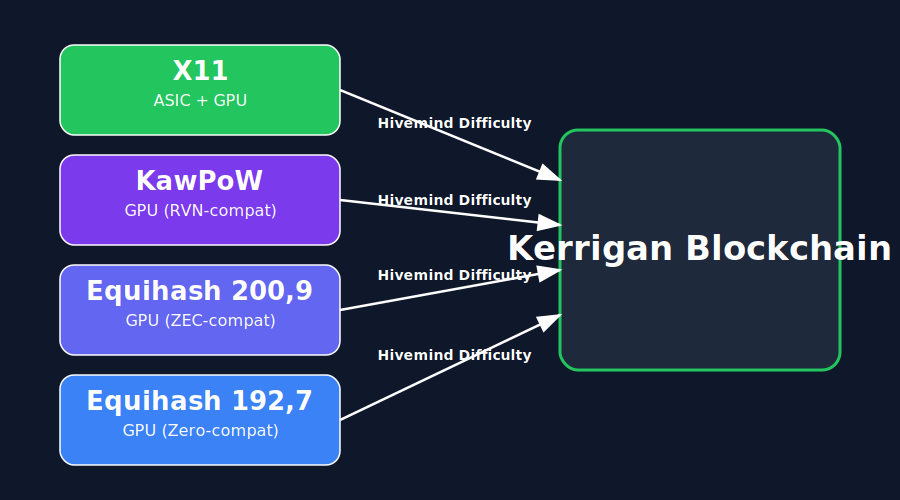
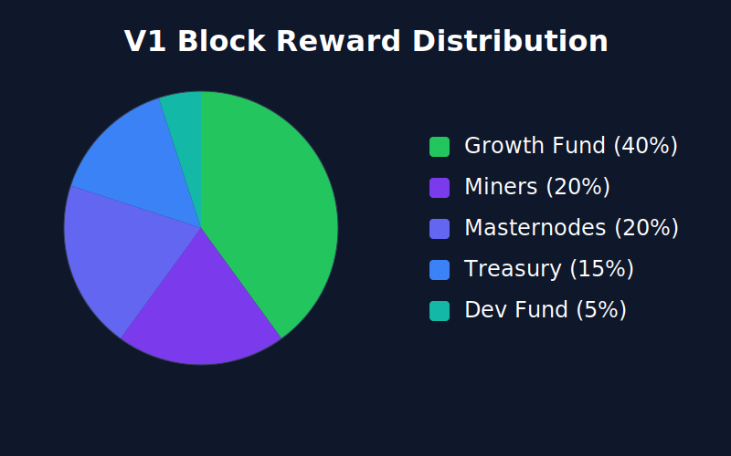
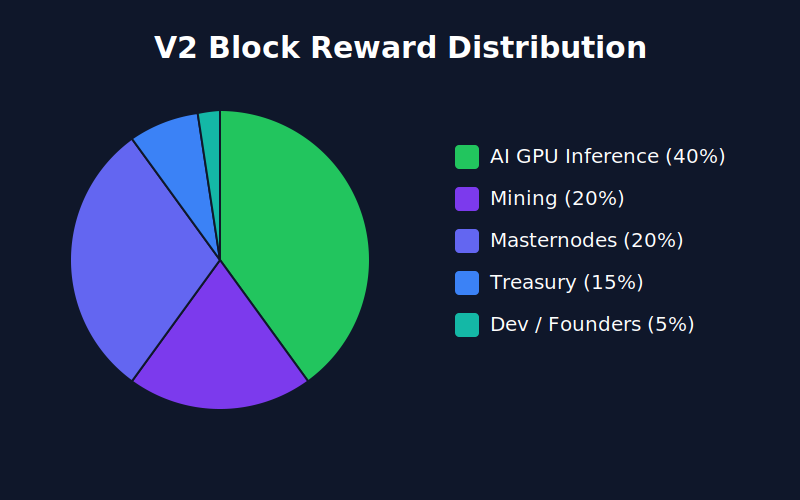

# Kerrigan: A Multi-Algorithm Proof-of-Work Cryptocurrency with Zero-Knowledge Privacy and Seal-Based Consensus

**Version 1.0 | March 2026**

> *"Spin sequences. Combine. Improve. Never perfect. Perfection goal that changes."*
> — Abathur, *StarCraft II: Heart of the Swarm*

---

## Abstract

Kerrigan is a multi-algorithm proof-of-work cryptocurrency that combines hardware diversity, zero-knowledge privacy, and a novel seal-based consensus layer called the Hivemind Protocol. Four mining algorithms (X11, KawPoW, Equihash 200,9, and Equihash 192,7) run simultaneously from genesis, each with independent difficulty adjustment derived from DigiByte's multi-algo approach. Sapling zk-SNARK shielded transactions give users the option of full transactional privacy. The Hivemind Protocol adds a second consensus dimension on top of PoW, where miners collectively seal blocks through BLS-signed attestations and verifiable random committee selection. V1 launches as a mining-focused chain with masternodes and on-chain governance. V2 extends the network into GPU compute for AI inference, redirecting block rewards to incentivize inference providers alongside miners.

---

## 1. Introduction

Most proof-of-work blockchains depend on a single mining algorithm. This creates a fragile network where one hardware manufacturer or one ASIC design can dominate hash rate, and a single algorithmic vulnerability can compromise the entire chain. Bitcoin's SHA-256 is mined almost exclusively by specialized ASICs. Ethereum Classic's Ethash saw repeated 51% attacks after GPU miners migrated to proof-of-stake Ethereum. Single-algorithm chains concentrate risk.

Privacy is the other gap. Transparent PoW chains expose every transaction to public analysis. Chain analysis firms can trace funds across hops, link addresses to identities, and build complete financial profiles. Some chains bolt on optional privacy as an afterthought; others sacrifice transparency entirely. Neither extreme serves users well.

Kerrigan addresses both problems. Four mining algorithms ensure that no single hardware class can monopolize block production. ASIC miners compete on X11 while GPU miners spread across KawPoW, Equihash 200,9, and Equihash 192,7. Each algorithm has its own difficulty adjustment, so hash rate shifts between algorithms don't destabilize the network. Sapling zk-SNARK shielded transactions provide cryptographic privacy for users who want it, without removing the transparent transaction layer.

The chain is built on a Dash fork, inheriting the deterministic masternode list (DIP3), quorum-based services (LLMQ), and the spork system for safe feature activation. We stripped what we didn't need, replaced what didn't fit, and built new systems where the inherited code fell short. The multi-algorithm PoW engine, the Sapling integration, and the Hivemind Protocol are all original to Kerrigan.

---

## 2. Multi-Algorithm Proof of Work



Kerrigan runs four mining algorithms in parallel, all active from the genesis block. Every block is mined by exactly one algorithm, and the algorithm is encoded directly in the block version field.

### 2.1 Algorithms

**X11** is Dash's native hash function: eleven chained cryptographic functions (BLAKE, BMW, Groestl, JH, Keccak, Skein, Luffa, CubeHash, SHAvite, SIMD, ECHO). It is ASIC-mineable, which means X11 hash rate will likely be dominated by specialized hardware. This is intentional. ASICs provide consistent, high-throughput hashing that stabilizes the base layer.

**KawPoW** is Ravencoin's ProgPoW variant, a GPU-optimized algorithm that resists ASIC development through random program generation. Kerrigan's KawPoW implementation is wire-compatible with Ravencoin, meaning existing RVN miners can point their rigs at Kerrigan pools with minimal configuration. KawPoW blocks carry additional header fields: `nHeight`, `nNonce64` (8-byte nonce), and `mix_hash` (32 bytes).

**Equihash 200,9** is Zcash's memory-hard algorithm. The (200,9) parameters require roughly 700 MB of working memory per solution attempt. ASICs do exist for Equihash 200,9 (notably the Bitmain Z9 series), so this lane is not strictly GPU-only. Kerrigan uses a Zcash-compatible 140-byte header format: 108 bytes from `CEquihashInput` (version, previous hash, merkle root, reserved hash, time, bits) plus a 32-byte `nNonce256`. Solutions are serialized with a 1400-byte cap.

**Equihash 192,7** uses different parameters that reduce memory requirements compared to (200,9) while maintaining ASIC resistance. The (192,7) parameter set was popularized by ZClassic and other Equihash forks. Same header format as Equihash 200,9 but with its own solution space and difficulty curve.

### 2.2 Version Encoding

The mining algorithm is encoded in bits 8 through 11 of the block's `nVersion` field, using a mask of `0x0F00`:

| Algorithm | Internal Enum | Version Bits | Hex |
|-----------|--------------|-------------|-----|
| X11 | `ALGO_X11 = 0` | `0 << 8` | `0x0000` |
| KawPoW | `ALGO_KAWPOW = 1` | `2 << 8` | `0x0200` |
| Equihash 200,9 | `ALGO_EQUIHASH_200 = 2` | `4 << 8` | `0x0400` |
| Equihash 192,7 | `ALGO_EQUIHASH_192 = 3` | `6 << 8` | `0x0600` |

The internal enum values (0-3) are used in code for array indexing. The version bits use even spacing (0, 2, 4, 6) to leave room for future algorithms. The mapping between them is a lookup, not a direct bit shift of the enum value.

Any code that inspects `nVersion` for BIP9 soft-fork signaling must strip bits 8-11 first. The `WarningBitsConditionChecker` skips these bits to avoid false alerts.

### 2.3 Hashing

Kerrigan uses two distinct hashes per block: an identity hash for indexing and a proof-of-work hash for mining validation.

The **identity hash** is X11 computed over the block's base header. For X11 and KawPoW blocks, this is the standard 80-byte header (version, previous hash, merkle root, time, bits, nonce). For Equihash blocks, it is 140 bytes (version, previous hash, merkle root, hashReserved, time, bits, nNonce256). This is what `hashPrevBlock` references, what RPCs return, and what the chain index uses. X11 is used for identity hashing on all algorithms so that every node can index every block the same way.

The **proof-of-work hash** is algorithm-specific and commits to all consensus-critical fields for that algorithm:
- **X11:** X11 over the 80-byte header (identity hash = PoW hash)
- **KawPoW:** ProgPoW hash over the sha256d header hash plus `nHeight`, `nNonce64`, and `mix_hash`. The ProgPoW seed is sha256d (not X11), matching the Ravencoin standard for wire compatibility with existing KawPoW miners. Byte-order reversal between ethash's big-endian format and Bitcoin's little-endian `uint256` happens at every conversion boundary.
- **Equihash 200,9 / 192,7:** The solution is validated against `CEquihashInput` (108 bytes) plus `nNonce256` (32 bytes) as the puzzle input. The solution itself is committed in the block's serialization. Any change to the Equihash nonce or solution invalidates the block.

This two-hash design means: the identity hash provides a stable, uniform block ID across all algorithms, while the PoW hash ensures that algorithm-specific fields (solutions, mix hashes, extended nonces) are fully committed and tamper-evident. See Appendix A for the exact serialized byte layouts per algorithm.

### 2.4 Hivemind Difficulty

Each algorithm has its own independent difficulty, adjusted using a scheme derived from DigiByte's multi-algo difficulty (DigiShield v4). The parameters:

- **Target block spacing:** 120 seconds overall, 480 seconds per algorithm (each algo targets ~25% of blocks)
- **Averaging window:** 10 blocks per algorithm (40 total blocks lookback)
- **Adjustment bounds:** max 8% harder, max 16% easier per retarget period
- **Local adjustment:** 4% per-algo correction (DigiByte V4 compatible)
- **Stale recovery:** if no block is mined for an algorithm within 240 blocks, difficulty resets to the algorithm's minimum

This per-algo difficulty means a sudden influx of GPU miners on KawPoW won't affect X11 difficulty or Equihash difficulty. Each algorithm finds its own equilibrium independently.

---

## 3. Tokenomics

### 3.1 Supply

- **Maximum supply:** 52,560,000 KRGN
- **Block subsidy:** 25 KRGN
- **Halving interval:** every 1,051,200 blocks (approximately 4 years at 120-second blocks)
- **Block time:** 120 seconds (2 minutes)

The supply follows a standard halving schedule: 25 KRGN for the first 1,051,200 blocks, then 12.5, then 6.25, and so on. The geometric series converges to 52,560,000 KRGN total.

### 3.2 V1 Block Reward Distribution



Every block's coinbase transaction splits the 25 KRGN reward five ways:

| Recipient | Share | KRGN/Block | Custody | Purpose |
|-----------|-------|-----------|---------|---------|
| Growth Fund | 40% | 10.00 | Consensus-locked escrow | Exchange listings, partnerships, ecosystem development |
| Miners | 20% | 5.00 | Released immediately | PoW block reward |
| Masternodes | 20% | 5.00 | Released immediately | Network services (falls to miner if no MNs registered) |
| Treasury | 15% | 3.75 | 2-of-3 multisig | Operational costs, marketing, community, team salaries |
| Dev / Founders | 5% | 1.25 | Released immediately | Founder compensation and ongoing project commitment |

The growth fund is not a treasury. It is a consensus-locked escrow that the team cannot spend without masternode approval (see Section 3.4). The Treasury and Dev/Founders allocations (20% combined) are the project's operating budget, comparable to Zcash's historical 20% dev fund. The Treasury address is a 2-of-3 P2SH multisig requiring two of three keyholders to authorize any spend. If no masternodes are registered on the network, the 20% masternode share stays with the miner as a graceful degradation mechanism.

### 3.3 Why 40% Growth Escrow

Kerrigan has no VC backing, no ICO, no pre-mine, and no token sale. The hardware runs out of pocket. The code is written by the team. There is no $5M war chest sitting in a multisig from a seed round.

That means the network has to fund its own growth. Exchange listings, liquidity provisioning, bridge deployments, and partnership deals cost real money, and without external funding, the chain itself is the only source. The growth escrow is the mechanism that turns mined coins into a tradeable asset. No exchange listing means no liquidity. No liquidity means the coins miners earn are worthless.

The growth escrow accumulates 10 KRGN per block:
- **7,200 KRGN per day** (720 blocks/day)
- **216,000 KRGN per month**
- **2,628,000 KRGN per year**

Here is what that looks like at different KRGN prices, assuming a typical tier-2 exchange listing at $150,000 and a tier-3 listing at $30,000:

| KRGN Price | Escrow / Month | Time to Tier-3 Listing ($30K) | Time to Tier-2 Listing ($150K) |
|-----------|-------------------|------------------------------|-------------------------------|
| $0.01 | $2,160 | ~14 months | ~69 months |
| $0.05 | $10,800 | ~3 months | ~14 months |
| $0.10 | $21,600 | ~6 weeks | ~7 months |
| $0.50 | $108,000 | ~8 days | ~6 weeks |
| $1.00 | $216,000 | ~4 days | ~3 weeks |

Even at $0.05 per KRGN, the escrow can finance a tier-3 exchange listing within a single quarter. At $0.10, a tier-2 listing becomes achievable within the first year.

The escrow is temporary. It has a hard ceiling at block 262,800 (~12 months). Every coin in it is locked from the moment it is minted. No coin leaves the escrow without a masternode vote approving a specific expenditure. The miners who fund early growth get rewarded with a functioning ecosystem and a coin that trades on real exchanges.

### 3.4 Growth Escrow: Locked Until Voted

The growth fund's 40% allocation is minted every block and sent to a consensus-locked escrow address. The coins exist on-chain, count toward total supply, and are fully auditable, but they cannot be spent. No multisig signer, no team member, no single entity can move them. Spending requires the masternode network to approve a specific proposal.

**How it works:**

1. Every block, 10 KRGN is sent to the growth escrow address. The coins are created on the normal emission schedule (preserving the hard cap of 52,560,000 KRGN).
2. Spending proposals are submitted to the governance system describing a specific expenditure: amount, recipient address, and purpose (e.g., "Release 50,000 KRGN to [address] for tier-3 exchange listing").
3. Masternode operators vote using their registered voting keys via `gobject vote-many`. The standard governance threshold applies: the proposal passes if `YES - NO >= max(10, weighted_masternode_count / 10)`.
4. If a proposal passes, the specified amount is unlocked from the escrow for that specific spend. If it fails, the coins stay locked.
5. Coins that remain locked at block 262,800 (~12 months) are burned via `OP_RETURN`. This is a consensus rule, not a governance decision.

**Continuation vote:** Every superblock cycle (16,616 blocks, approximately 23 days), the escrow's continued accumulation must also be renewed by masternode vote. If the continuation vote fails, the 40% coinbase output burns for the next cycle instead of entering the escrow. No vote means no accumulation. Apathy kills the fund, not action.

**Why this design:**

- **The team cannot touch the money.** The escrow is consensus-locked. Multisig signers have no special access. Only a passed governance vote can release funds. This is not a promise; it is a consensus rule.
- **Supply stays predictable.** All 25 KRGN per block are minted on schedule. The emission curve is identical to a chain without a growth fund. The hard cap of 52,560,000 KRGN is real and verifiable at any block height.
- **Every spend is a public vote.** There are no silent withdrawals, no discretionary spending, no "we'll report monthly." Each expenditure is a governance proposal that the masternode network approves or rejects.
- **23-day accountability cycle.** The continuation vote forces regular re-evaluation of whether the escrow is earning its keep.
- **Hard ceiling prevents capture.** Even if a majority of masternodes are controlled by the same entity, the escrow cannot exist past 12 months. Remaining coins burn.

**What happens at sunset:** When the growth escrow ends (by failed continuation vote or hard ceiling at block 262,800), remaining locked coins burn via `OP_RETURN`. The 40% coinbase allocation burns for all subsequent blocks. This does not redirect to miners, masternodes, or any other party. Burned coins reduce circulating supply, benefiting all holders equally. The V2 block reward restructure (Section 3.6) is a separate consensus upgrade that redirects the 40% to AI inference providers.

### 3.5 Operating Budget: Treasury and Dev/Founders

The remaining 20% of block rewards (Treasury 15% + Dev/Founders 5%) is the project's operating budget. These coins are released normally, not escrow-locked.

**Treasury (15% / 3.75 KRGN per block):** Operational costs that keep the project running. Marketing, community management, moderator compensation, server costs, airdrops, giveaways, and partnership expenses. The Treasury address is a 2-of-3 P2SH multisig wallet requiring two of three keyholders to authorize any spend.

**Dev / Founders (5% / 1.25 KRGN per block):** Compensation for building Kerrigan from scratch and ongoing commitment to maintaining and developing the protocol. Released directly with no lock.

This 20% operating budget is comparable to Zcash's historical 20% development fund. The difference: Kerrigan's growth capital (the other 40%) sits in a consensus-locked escrow that the team cannot access without network approval. Only 20% is freely spendable.

**Accountability for the operating budget:**
- **2-of-3 multisig** on the Treasury address. No single keyholder can move funds unilaterally.
- **Public accounting** aligned to the 23-day superblock cycle. Fund balances and outflows published via a public dashboard.
- **Signer rotation.** Multisig keyholders are published. Key rotation procedures are documented. Compromised keys trigger an emergency rotation via the remaining 2-of-3 signers.

### 3.6 V2 Block Reward Distribution (Future)



V2 restructures the block reward around the AI inference network. GPU operators earn pay-per-inference revenue on top of their block reward share, making Kerrigan mining hardware productive between blocks:

| Recipient | V1 Share | V2 Share | Notes |
|-----------|----------|----------|-------|
| AI GPU Inference | 0% | 40% | On top of pay-per-inference earnings |
| Mining | 20% | 20% | Unchanged |
| Masternodes | 20% | 20% | Unchanged |
| Treasury | 15% | 15% | Unchanged |
| Dev / Founders | 5% | 5% | Unchanged |
| Growth Fund | 40% | 0% | Completed its purpose |

The growth fund drops to zero once the ecosystem is established. The 40% that fueled early exchange listings and partnerships redirects to AI GPU inference participants, turning Kerrigan into a dual-purpose chain: mining secures the network while GPU compute serves AI workloads. The 40% inference allocation stacks on top of direct pay-per-inference fees, giving GPU operators two revenue streams for the same hardware.

---

## 4. Sapling Shielded Transactions

Kerrigan integrates Zcash's Sapling protocol for zero-knowledge shielded transactions. Users can move funds between transparent addresses (starting with 'K') and shielded addresses using Groth16 zk-SNARK proofs that reveal nothing about the sender, receiver, or amount.

### 4.1 Transaction Structure

Shielded transactions use `nType = 10` (`TRANSACTION_SAPLING`). The extra payload contains:

- **Spend descriptions:** each references a previously created note, proves knowledge of the spending key, and reveals the note's nullifier to prevent double-spends
- **Output descriptions:** each creates a new shielded note with a value commitment, a note commitment added to the global Merkle tree, and an encrypted payload only the recipient can decrypt
- **Value balance:** the net value flowing between the transparent and shielded pools (positive means value entering transparent, negative means value entering shielded)
- **Binding signature:** proves that the transaction's value commitments balance correctly

The maximum is 500 spend descriptions and 500 output descriptions per transaction. The Rust Sapling builder pads output bundles to a minimum of 2 outputs (adding dummy outputs if needed) to prevent transaction graph analysis based on output count.

### 4.2 Cryptographic Foundation

The Sapling circuit runs on the Jubjub elliptic curve embedded within BLS12-381. Proofs are generated and verified through a Rust FFI bridge using the `bellman`, `jubjub`, and `group` crates, compiled via CXX into the C++ node.

Key primitives:
- **Note commitment:** Pedersen hash of (value, payment address, randomness)
- **Nullifier:** derived from note position and spending key, unique per note
- **Value commitment:** Pedersen commitment to the note value with randomness
- **Incremental Merkle tree:** 32-level tree tracking all note commitments on chain

The Merkle tree frontier (the minimal data needed to append new leaves) is stored per block in LevelDB. Wallet-side witnesses track each note's authentication path for spend proofs.

**Trusted setup:** Kerrigan reuses Zcash's Sapling parameters (the proving and verifying keys generated by the Zcash Powers of Tau ceremony and Sapling MPC). The circuits are identical to Zcash Sapling. No new trusted setup ceremony is required for shielded transactions.

### 4.3 Signing

Transaction signing follows a ZIP 243-style sighash scheme. The sighash preimage includes `hashPrevouts`, `hashSequence`, and `hashOutputs` covering both transparent and shielded components. This prevents signature malleability and ensures that transparent and shielded portions of a transaction are bound together cryptographically.

### 4.4 Fee Structure

Shielded transactions use an action-based fee model:
- **Base fee:** 10,000 satoshis (0.0001 KRGN)
- **Per spend:** 5,000 satoshis
- **Per output:** 5,000 satoshis (all outputs including privacy padding are charged)

### 4.5 Activation and RPCs

Sapling activates at mainnet block 500, approximately 16 hours after genesis. Nine RPCs provide full wallet functionality:

| RPC | Function |
|-----|----------|
| `z_getnewaddress` | Generate a new shielded address |
| `z_listaddresses` | List all shielded addresses in the wallet |
| `z_getbalance` | Get the shielded balance for an address |
| `z_listunspent` | List unspent shielded notes |
| `z_sendmany` | Send to/from shielded addresses (t-to-z, z-to-z, z-to-t) |
| `z_exportkey` | Export a shielded spending key |
| `z_importkey` | Import a shielded spending key |
| `z_exportviewingkey` | Export a Sapling full viewing key |
| `z_importviewingkey` | Import a Sapling full viewing key |

---

## 5. Masternodes and Governance

### 5.1 Masternode Types

Kerrigan supports two masternode tiers inherited from Dash's evolution framework:

| Type | Collateral | Voting Weight |
|------|-----------|---------------|
| Regular | 10,000 KRGN | 1x |
| Evo (HPMN) | 40,000 KRGN | 4x |

Masternodes are registered on-chain using DIP3 deterministic registration transactions:
- **ProRegTx:** register a new masternode with collateral, operator key, and payout address
- **ProUpServTx:** update service parameters (IP, port)
- **ProUpRegTx:** update registration (operator key, voting key, payout address)
- **ProUpRevTx:** revoke a masternode's operator key

The deterministic masternode list is derived entirely from on-chain transactions. Every node computes the same list from the same chain state, eliminating the consensus disagreements that plagued non-deterministic masternode systems.

### 5.2 Quorum Services

Long-Living Masternode Quorums (LLMQs) enable two key services:

**InstantSend** locks transaction inputs within seconds, preventing double-spend attempts. A quorum of masternodes signs a lock message, and any conflicting transaction is rejected by the network.

**ChainLocks** finalize blocks by having a quorum sign the first block seen at each height. Once a ChainLock signature propagates, the block cannot be reorganized out, even by a 51% attacker.

Both services are spork-gated and disabled at genesis. LLMQ requires a minimum number of registered masternodes to form quorums, so these features activate via spork once the masternode set reaches critical mass:
- `SPORK_2_INSTANTSEND_ENABLED`
- `SPORK_17_QUORUM_DKG_ENABLED`
- `SPORK_19_CHAINLOCKS_ENABLED`

### 5.3 Governance

Masternode operators can submit budget proposals and vote on them. Proposals pass if `YES - NO >= max(10, weighted_masternode_count / 10)`. The governance system handles community proposals, marketing initiatives, and infrastructure funding. It also controls the growth fund continuation vote (Section 3.4): the 40% growth fund allocation must be actively renewed by masternode vote every superblock cycle (~23 days) or it burns automatically.

---

## 6. Hivemind Protocol (HMP)

### 6.1 The Core Idea

In a real bee colony, every member carries chemical markers that identify them as part of the hive. No single bee produces the colony's smell. It emerges from the collective. The Hivemind Protocol works the same way: mining pools collectively produce a cryptographic "pheromone" that is woven into every block. Like mixing paint colors, blue and yellow and red go in, you get a specific shade of brown. You can verify the brown is correct. You cannot unmix it to extract the individual colors. But if someone tries to make that brown without the blue, it is the wrong shade. Immediately detectable.

HMP sits on top of proof-of-work. PoW determines who mines a block. HMP determines whether the network's active miners vouch for that block. An attacker who forks the chain in secret cannot bring the colony's pheromone with them, because the honest miners never participated in the fork. The attack chain smells wrong.

### 6.2 Pool Software Compatibility

A critical design requirement: **no mining software changes.** HMP operates entirely within the daemon. Pool software (s-nomp, Miningcore, or any Stratum-compatible stack) talks to the daemon through standard `getblocktemplate` and `submitblock` RPCs. The daemon handles identity management, seal signing, seal assembly, commitment broadcasting, and P2P relay internally. Block templates already include embedded HMP seal data in the coinbase transaction, the same pattern used by BIP34 (height in coinbase), SegWit (witness root in coinbase), and merge mining (AuxPoW in coinbase). Miners hash the template blindly. The Stratum protocol is unchanged.

### 6.3 Identity and Privilege

Every daemon generates a persistent BLS keypair on first run (stored as `hmp_identity.dat`). This identity is loaded automatically on startup. As the daemon mines blocks and participates in sealing, it builds a privilege record:

| Tier | Requirements | Capabilities |
|------|-------------|-------------|
| UNKNOWN | No history, or in 10-block warmup | Cannot seal |
| NEW | Completed warmup, participating | Can seal with standard weight |
| ELDER | Solved 10+ blocks AND seal participation within 100-block window | Full weight, cross-algo bonus eligible |

The privilege window is 100 blocks. A miner who stops participating drops back to UNKNOWN after falling out of the window. Privilege requires real work: you cannot become an ELDER without actually solving blocks, which converts any Sybil attack into an expensive honest mining operation.

### 6.4 Roll Call (Phase 1: Pubkey Commitments)

Before sealing, a daemon must commit its BLS public key on-chain. Think of this as the attendance sheet. Every daemon that wants to participate broadcasts its public key. These keys reach the chain two ways: implicitly (by mining a block, which embeds the miner's pubkey in the CCbTx v4 `minerIdentity` field) or explicitly (up to 16 additional pubkey commitments per block in CCbTx v5's `vCommitments` field).

A committed key must mature for 10 blocks before the signer becomes eligible. This is the warmup penalty. If a profit-switching service like NiceHash cycles in bursts shorter than warmup (~20 minutes), those miners never contribute to the pheromone at all. They mine, earn rewards, leave. Zero impact on colony identity.

If a committed key stays long enough to earn privilege, it becomes one equal voice in the colony. When it leaves, one voice disappears. The colony's scent barely changes.

### 6.5 Sealing (Phase 2: Pheromone Production)

When a new block arrives, the daemon automatically checks eligibility, computes a VRF proof, signs the block hash with its BLS key, and broadcasts the seal share to the network. This happens in `ConnectBlock` with no pool involvement.

Each seal share contains:
- A BLS signature over `H("KRGN-HMP-SEAL-V1" || blockHash || signerPubKey || algoId)` (domain tag prevents cross-context replay; pubkey and algoId binding prevents cross-signer and cross-algo replay)
- The signer's algorithm domain (which of the 4 algos they mine)
- A VRF proof for committee selection
- A zero-knowledge proof (Groth16 over a MiMC circuit) proving honest participation

**What the zk proof asserts:** the signer had knowledge of the public chain state at a recent height, the commitment was generated after observing that state (prevents pre-computation), and the key material is fresh for this round (prevents replay).

**What the zk proof conceals:** the signer's specific hashrate, the exact timing of their observations, and the private key material used in the commitment. Note that seal shares include the signer's public key (pseudonymous identity is visible for privilege tracking), but the zk proof ensures that operational details and key material remain private.

**Why this matters for attacks:** an attacker mining a secret fork cannot produce valid proofs because they were not observing the public chain at the required moments. The proof inputs reference entropy derived from public chain state that only exists on the honest chain. Proofs are bound to specific block hashes, so they cannot be transplanted between chains.

Seal shares propagate via `SEALSHARE` P2P messages. After a 5-second signing window, the daemon assembles collected shares into a `CAssembledSeal` with an aggregated BLS signature. The seal for block N is embedded in the coinbase of block N+2, giving the network time to collect shares without stalling block production. Mining never waits for signatures.

**Setup for HMP proofs:** the MiMC commitment circuit uses Groth16 on BLS12-381. The circuit is intentionally small (prover time <2s on commodity hardware, verifier time <50ms, proof size <256 bytes). The proving and verifying keys are generated via a multi-party computation ceremony. The security assumption is standard for Groth16: the setup is secure if at least one ceremony participant was honest and destroyed their toxic waste. Ceremony transcripts and parameter hashes are published for verification.

### 6.6 Chain Selection

HMP modifies chain selection by adding a per-block seal bonus to the standard cumulative PoW:

```
chain_weight = sum( block_pow_work + seal_bonus(block) )  for all blocks in chain
```

For each block, the seal multiplier is computed as a basis-point value applied to `block_pow_work`:

```
weighted_proof = block_pow_work * seal_multiplier / 10000

seal_multiplier:
  No seal or below threshold:     10000 bps (1.0x, neutral)
  Partial shade (≥ threshold):    12000-15000 bps (interpolated by Elder ratio)
  Full shade (all Elders signed): 15000-18000 bps (interpolated by Elder ratio)
  Cross-algo bonus:               +500 bps per additional ELDER algo domain (max +1500)
  Maximum possible:               19500 bps (1.95x)
```

The seal multiplier uses a graduated tier system. Only ELDER-tier signatures whose `algoId` matches the block's mining algorithm count toward same-algo completeness. Within each tier, the multiplier interpolates linearly based on the ratio of Elders present to total Elders for the algo. The cross-algo bonus adds a flat +500 basis points per additional ELDER algorithm domain (beyond the block's own), capped at +1500 bps (all 4 algos represented). A fully sealed block with all 4 algo domains reaches 1.95x its PoW work. An unsealed block is worth 1.0x. Over hundreds of blocks, a chain with consistently complete pheromones accumulates significantly more weight than a chain with weak or absent pheromones, even if the raw PoW is equivalent.

The required signer agreement scales with the per-algo ELDER count:

| Elders (per algo) | Required Agreement | Rationale |
|---|---|---|
| 6+ | 80% | Full security, absorbs individual failures |
| 4-5 | 75% | Strong, slightly more tolerant |
| 3 | 66% (2 of 3) | Degraded but functional |
| 2 | 100% (both) | Maximum caution |
| 0-1 | N/A, pure PoW mode | Colony not yet established |

This means the network starts in pure PoW mode and transitions to HMP-secured consensus organically as the mining colony grows. Security emerges from participation, not from a flag day.

### 6.7 VRF Committee Selection (Relay Layer)

Not every registered signer participates in every seal. BLS-VRF (Verifiable Random Function) gates which signers' shares are relayed across the P2P network. The previous block's hash seeds the VRF. Each eligible daemon runs the VRF with their long-term key. Selection is deterministic (all nodes can verify who was eligible) but unpredictable (depends on block hashes nobody can predict in advance).

In V1, VRF is a relay-layer filter, not a consensus rule. Nodes drop seal shares from signers who fail VRF eligibility, reducing network bandwidth and making it harder for an attacker to grind or flood the share pool. Chain selection scoring counts all valid BLS signatures in the assembled seal regardless of VRF status (see Appendix A.4). Future protocol upgrades may promote VRF eligibility to a consensus-level seal validity check.

### 6.8 Dominance Catch

A pool is privileged if it solved a block in the last 100 blocks, OR if it is one of the last 6 unique pools to solve a block on that algorithm, whichever lookback reaches further. This means the privileged set on any algorithm can never shrink below 6 (assuming 6 distinct pools have ever mined that algo).

If a large profit-switching pool mines 100 straight KawPoW blocks, the 5 other pools that most recently solved KawPoW blocks before that streak are still considered privileged. Their voices remain in the colony. The extended lookback caps at 1,000 blocks (~33 hours). Beyond that, participation is too stale to count.

### 6.9 Why Not Just Use ChainLocks?

Kerrigan inherits Dash's ChainLock system (LLMQ-based block finalization by masternodes), and it will be activated via spork once enough masternodes are registered. But ChainLocks require a functioning masternode quorum, which takes time to build after genesis. HMP fills the gap: it provides reorg resistance from day one using the miners who are already on the network. As the masternode set grows, ChainLocks layer on top of HMP for additional finality. They complement each other.

### 6.10 The Four-Screen Multiplex

You are in a movie theater. You leave mid-film to get popcorn. On your way out, you notice a guy in a red shirt by the door, an elderly couple in the third row, a group of teenagers near the front. You get your popcorn, walk back in, and immediately something is wrong. Red shirt is gone. The elderly couple moved. The teenagers disappeared. None of the faces are right. You are in the wrong screening room. You did not need anyone to tell you — you just noticed the people you expected are not here.

That is how HMP detects an attack chain. The network knows which miners have been showing up — solving blocks, participating in seals, earning ELDER status. When a competing chain appears, the protocol checks whether those familiar faces are present. If the regulars are missing, the chain smells wrong. No cross-chain comparison needed. You just walked into the wrong room.

Now scale it to four rooms. Kerrigan does not run one screening — it runs a four-screen multiplex. X11, KawPoW, Equihash 200,9, and Equihash 192,7 each have their own room with their own regulars. An X11 pool earns its reputation in the X11 room. A KawPoW pool earns its reputation in the KawPoW room. They are completely independent communities with completely different hardware.

A block is strongest when regulars from multiple rooms vouch for it. A KawPoW block endorsed only by KawPoW regulars gets a partial bonus. Add signatures from X11 regulars, Equihash 200,9 regulars, and Equihash 192,7 regulars, and the block earns a cross-algo bonus (Section 6.6), up to 1.95x its raw PoW weight. An attacker needs to fill all four rooms with convincing faces simultaneously — four independent crowds, four independent hardware ecosystems, four independent histories of honest mining, all faked at once.

### 6.11 What a 51% Attack Actually Looks Like

Consider the most sophisticated attacker possible: unlimited budget, technical expertise, patience.

1. **Acquire hashrate across all 4 algorithms.** Different hardware for each. Four independent procurement problems.
2. **Survive the 10-block warmup period.** Visible on the public network the entire time.
3. **Commit public keys on the public chain.** Creates a permanent record of their existence.
4. **Earn ELDER privilege on all 4 algorithms.** Must solve blocks AND participate in sealing within the lookback window, per algorithm. Mining honestly the entire time.
5. **Begin mining the secret fork.** This is where it falls apart:
   - Honest pools never committed to the fork. Their Phase 1 public keys were committed to the public chain. The fork does not have their attendance sheet.
   - Honest pools never added their paint. The attacker's blocks are missing most of the colony's ELDER signatures. The pheromone is incomplete.
   - The attacker's seals can only contain their own ELDER signatures. With honest ELDERs absent, the completeness ratio is low and the seal bonus is fractional.
   - Cross-algo bonus requires ELDER-tier signatures from 2+ algorithm domains. An attacker controlling only one hardware ecosystem gets no cross-algo weight.
   - At the relay layer, VRF filtering and zk proof checks make it harder for the attacker to harvest or replay seal shares from the honest network.
6. **Broadcast the attack chain.** The honest chain has higher total weight (complete ELDER seals with cross-algo bonuses). The attack chain has lower weight (incomplete seals, missing ELDER signatures). Nodes follow the heavier chain.

The layers are not independent obstacles. They are mutually reinforcing. You cannot earn privilege without mining honestly, which strengthens the chain you are trying to attack. You cannot produce valid pheromone on a secret fork because the honest pools never contributed their paint. The attacker does not face seven problems. They face one impossible problem viewed from seven angles: can you be both isolated and collaborative at the same time?

### 6.12 Censorship and Cartel Risks

HMP is a coordination mechanism, and coordination mechanisms can be abused. A cartel of ELDER signers controlling enough privilege to fill `expected_signers` could selectively withhold seals from blocks mined by targeted pools. The targeted pool's blocks would accumulate less chain weight (lower completeness ratio), making them more likely to lose reorg races against sealed blocks.

Several factors limit this attack surface:

- **Seal signing is automatic.** The daemon signs every valid block it sees. Selective withholding requires modified software, which is detectable if the daemon is open-source and reproducible builds are available.
- **Unsealed blocks are not invalid.** They carry 1.0x PoW weight. A cartel can make targeted blocks lighter, not rejected. Over long chains, the PoW still dominates if the cartel cannot also outpace the targeted pool's hash rate.
- **Dynamic threshold degrades gracefully.** If cartel members withhold, the effective `active_privileged_pools` count drops and the threshold table adjusts. At 0-1 active signers, the chain runs in pure PoW mode.
- **Dominance catch preserves representation.** A targeted pool that solved blocks within the extended lookback (up to 1,000 blocks) retains ELDER status even if the cartel tries to crowd them out.
- **Emergency kill switch.** `SPORK_25_HMP_ENABLED` disables HMP entirely, reverting to pure PoW chain selection. This is the nuclear option, but it exists.

The honest assessment: HMP increases the cost of 51% attacks by a significant margin, but it introduces a coordination surface that pure PoW lacks. A sufficiently large cartel of modified daemons could use seal withholding as a soft censorship tool. The mitigations above make this expensive and detectable, but not impossible. This tradeoff is intentional. The alternative (pure PoW without HMP) is strictly more vulnerable to the simpler and cheaper attack of hash rate rental.

### 6.13 Activation

HMP activates in stages on mainnet:

| Stage | Height | Description |
|-------|--------|-------------|
| Stage 2 | Block 100 | Pubkey commitments open |
| Stage 3 | Block 300 | Soft sealing begins (positive weights only) |
| Stage 4 | Block 500 | Full HMP with negative proofs |

**Positive vs negative proofs:** In Stage 3, sealed blocks receive bonus chain weight (positive proof: "this block has colony support"). In Stage 4, the absence of expected signers also becomes a signal (negative proof: "this chain is missing miners we know should be here").

Negative proofs are computed deterministically from the candidate chain alone, with no cross-chain comparison. Each chain carries its own privilege state: the set of ELDER signers is derived from that chain's block history (who solved blocks, who participated in seals, within the lookback window). If a chain's own privilege tracker shows 6 ELDER signers for KawPoW, but the seals on recent blocks only contain 2 of them, the completeness ratio is low and the seal bonus is fractional. No reference to any other chain is needed. Nodes evaluate each candidate chain independently using that chain's own state.

This is the movie theater test from Section 6.10: you walked into the wrong screening room and the regulars are not in their seats. No comparison needed — you just notice who is missing.

In V1, negative proofs affect chain weight scoring only. They are a selection heuristic, not a hard validity rule. A chain with missing signers is not invalid; it simply accumulates less weight than a chain where the expected signers are present. This conservative approach avoids false penalties under network partitions or transient connectivity issues. Future protocol upgrades may tighten negative proof enforcement as the network matures.

A runtime kill switch (`SPORK_25_HMP_ENABLED`) allows emergency deactivation if issues arise post-launch.

---

## 7. Network Parameters

### 7.1 Addressing

| Parameter | Value |
|-----------|-------|
| Pubkey address prefix | `K` (byte 45) |
| Script address prefix | `7` (byte 16) |
| Sapling bech32m HRP | `ks` |
| BIP44 coin type | 99888 (unregistered; formal SLIP-0044 registration pending) |
| Network magic | `0x4B 0x52 0x47 0x4E` ("KRGN") |

### 7.2 Ports

| Network | P2P Port | RPC Port |
|---------|---------|---------|
| Mainnet | 7120 | 7121 |
| Testnet | 17120 | 17121 |
| Devnet | 37120 | 19798 |
| Regtest | 27120 | 19898 |

### 7.3 DNS Seeds

Four geographically distributed seed nodes handle initial peer discovery:

| Seed | Region |
|------|--------|
| seed1.kerrigan.network | United States |
| seed2.kerrigan.network | India |
| seed3.kerrigan.network | Japan |
| seed4.kerrigan.network | Germany |

### 7.4 Compressed Headers

Kerrigan defines DIP25-based compressed block headers with extensions for multi-algo fields. Compressed headers are currently disabled pending resolution of multi-algo deserialization edge cases; initial block download uses full headers. A one-byte bitfield controls which fields are included:

- Bits 0-2: version offset (up to 7 recently-seen versions cached)
- Bit 3: previous block hash omitted (implied from chain)
- Bit 4: timestamp as offset from previous block
- Bit 5: nBits inherited from previous block
- Bit 6: Equihash extended fields present (nSolution, nNonce256, hashReserved)
- Bit 7: KawPoW extended fields present (nHeight, nNonce64, mix_hash)

This reduces header bandwidth significantly during initial block download, where only a fraction of blocks need full Equihash solutions or KawPoW data transmitted.

### 7.5 Genesis Block

| Parameter | Value |
|-----------|-------|
| Timestamp | 1,773,446,400 (Mar 11, 2026 12:00 UTC) |
| Nonce | 1,338,121 |
| Bits | 0x1e0ffff0 |
| Subsidy | 25 KRGN |
| Hash | `0x00000444f8dbee14c599ac723b35cc8021b12d48d092c7ac67d45f6d8a0b9c32` |

---

## 8. Security Model

### 8.1 Multi-Algorithm Diversity

The most direct security benefit of four mining algorithms is resistance to single-vector attacks. An attacker who controls 51% of X11 hash rate controls roughly 25% of the network's total block production. To execute a sustained 51% attack, they would need to dominate at least two algorithms simultaneously, or overwhelm one algorithm while outpacing honest miners across the others. The Hivemind Protocol makes this even harder: hash power alone is insufficient when chain selection also weighs seal attestations from registered, committed signers.

### 8.2 Shielded Transaction Security

Sapling's nullifier set prevents double-spends of shielded notes. Every note has a unique nullifier derived from its position in the Merkle tree and the spending key. Once a nullifier appears on chain, any transaction attempting to spend the same note is rejected at the consensus level. The Groth16 proofs are computationally sound under the discrete-log assumption on BLS12-381; forging a proof without knowing the witness is infeasible.

### 8.3 Wire Data Safety

All data deserialized from the P2P network is bounds-checked before it drives memory allocation, loop iteration, or array indexing. Equihash solutions are capped at 1,400 bytes. Seal signer lists are capped at 200 entries. ZK proofs are capped at 256 bytes. Pubkey commitment lists are capped at 16 per block. No field from network data can trigger unbounded allocation.

### 8.4 Emergency Controls

The spork system allows the development team to disable features in production without a hard fork. Critical sporks include:
- `SPORK_2_INSTANTSEND_ENABLED`: disable InstantSend
- `SPORK_19_CHAINLOCKS_ENABLED`: disable ChainLocks
- `SPORK_25_HMP_ENABLED`: disable Hivemind Protocol

Spork keys use a 2-of-3 threshold, requiring two of three keyholders to authorize any spork change.

---

## 9. Roadmap

### 9.1 V1: Launch (Q1 2026)

V1 is a mining-focused launch with all core systems active:

- All four mining algorithms live from genesis
- Per-algo Hivemind difficulty adjustment from block 1
- Masternodes with 10,000 KRGN collateral
- Sapling shielded transactions at block 500
- Hivemind Protocol: commitments at block 100, soft sealing at block 300, full HMP with negative proofs at block 500
- 5-way coinbase split funding growth, mining, masternodes, treasury, and development
- Spork-gated LLMQ services (InstantSend, ChainLocks) activating once masternode count supports quorum formation

### 9.2 V2: GPU Compute Network (~12 months post-launch)

V2 extends Kerrigan from a pure mining chain into a GPU compute network for AI inference. The core development estimate is roughly 12 weeks, with a 48-week total timeline that includes testing, auditing, and ecosystem readiness. The architecture is modular, so V2 can ship as soon as it is ready; the 12-month estimate is conservative, not a commitment.

V2 components:

**Inference Provider Registration:** GPU operators register on-chain with staking requirements, hardware attestation, and service endpoints. Registration transactions follow the same deterministic-list pattern as DIP3 masternodes, ensuring every node computes the same provider set.

**P2P Job Distribution:** Inference requests are distributed to providers through a gossip protocol. Job assignments use VRF-based selection weighted by provider stake and performance history. Results are committed on-chain with hash proofs for dispute resolution.

**Verifiable Compute:** Providers submit compute attestations that can be spot-checked by other providers. Incorrect results trigger slashing of the provider's stake. The verification scheme balances throughput (not every result is verified) with security (cheating is statistically detected and punished).

**Block Reward Restructure:** The coinbase split changes to direct 40% of block rewards to AI GPU inference participants, on top of their pay-per-inference earnings. Mining stays at 20%, masternodes at 20%, treasury at 15%, and dev/founders at 5%. The growth fund drops to zero, having served its purpose during the V1 launch phase.

### 9.3 Post-V2

With V1 and V2 complete, the focus shifts to ecosystem maturity:

- **Mining pools:** s-nomp and Miningcore forks with Kerrigan support for all four algorithms
- **Wallets:** Desktop GUI wallet (Qt5), light CLI wallet, and mobile wallet
- **Block explorer:** Public chain explorer with multi-algo and shielded transaction support
- **Exchange listings:** Funded by the growth fund, targeting tier-2 and tier-1 exchanges as KRGN value supports listing costs
- **Cross-chain bridges:** Wrapped KRGN on EVM chains for DeFi integration

---

## 10. Conclusion

Kerrigan solves the hardware centralization problem by making four mining algorithms compete in parallel, each on its own difficulty curve. Sapling shielded transactions give users real privacy backed by Groth16 zero-knowledge proofs. The Hivemind Protocol adds a second consensus dimension that makes 51% attacks substantially harder by requiring seal attestations from committed, proven miners.

The 40% growth fund ensures the project has the financial resources to build exchange presence and ecosystem infrastructure at any token price point. V1 launches as a complete, mining-focused blockchain. V2 extends the same GPU infrastructure into AI inference, turning mining hardware into general-purpose compute resources.

The code is open source. The chain parameters are fixed. The mining starts at genesis.

---

## References

| Component | Source Files |
|-----------|-------------|
| Multi-algo PoW | `src/primitives/block.h`, `src/primitives/block.cpp`, `src/pow.cpp` |
| Tokenomics | `src/chainparams.cpp`, `src/masternode/payments.cpp` |
| Sapling | `src/sapling/`, `src/rust/src/bridge.rs`, `src/sapling/sapling_tx_payload.h` |
| Masternodes | `src/evo/dmn_types.h`, `src/evo/deterministicmns.h` |
| HMP | `src/hmp/`, `src/rust/src/hmp/` |
| Network params | `src/chainparams.cpp`, `src/chainparamsbase.cpp` |
| Compressed headers | `src/primitives/block.h` (CompressibleBlockHeader) |

---

## Appendix A: Consensus Rules

### A.1 Header Serialization by Algorithm

**X11 (standard 80-byte header):**
```
[version:4][prevHash:32][merkleRoot:32][time:4][bits:4][nonce:4] = 80 bytes
```
Identity hash: X11(above). PoW hash: same.

**KawPoW (80-byte header + extended fields):**
```
[version:4][prevHash:32][merkleRoot:32][time:4][bits:4][nonce:4] = 80 bytes
Extended: [nHeight:4][nNonce64:8][mix_hash:32] = 44 bytes
```
Identity hash: X11(first 80 bytes). PoW hash: ProgPoW(sha256d(first 80 bytes), nHeight, nNonce64) verified against mix_hash. The ProgPoW seed hash is sha256d (not X11), matching the Ravencoin standard that all KawPoW miners use. Byte order: ethash uses big-endian (bytes[0] = MSB), Bitcoin uses little-endian (begin() = LSB). Bytes are reversed at every conversion boundary.

**Equihash 200,9 and 192,7 (140-byte input + solution):**
```
CEquihashInput: [version:4][prevHash:32][merkleRoot:32][hashReserved:32][time:4][bits:4] = 108 bytes
Mining input: [CEquihashInput:108][nNonce256:32] = 140 bytes
Solution: [nSolution: variable, max 1400 bytes]
```
Identity hash: X11(version + prevHash + merkleRoot + hashReserved + time + bits + nNonce256, 140-byte layout). PoW hash: validate Equihash solution against the same 140-byte input. The solution is committed in the block's full serialization.

**Equihash identity hash input:** Equihash blocks use the 140-byte input (including `hashReserved` and `nNonce256`) for identity hashing, not the 80-byte standard header. The 4-byte `nNonce` field is unused for Equihash blocks. Since the identity hash directly commits to `nNonce256`, there is no malleability between the mining nonce and the block ID.

### A.2 Block ID, prevHash, and Uniqueness

The block ID (referenced by `hashPrevBlock` in the next block) is the identity hash: X11 over the block's base header (80 bytes for X11/KawPoW, 140 bytes for Equihash variants). X11 is used for identity hashing on all algorithms.

**Uniqueness guarantee:** The 80-byte header includes the merkle root, which commits to the full coinbase transaction. The coinbase contains: BIP34-mandated block height, the miner's payout address, HMP identity data (CCbTx v4+ includes the miner's BLS pubkey), embedded seal data, and a pool-specific extranonce. Two independently-mined blocks at the same height will always produce different coinbase transactions (different miners, different extranonces, different HMP identities), and therefore different merkle roots, and therefore different identity hashes.

To make this guarantee explicit at the protocol level: Kerrigan requires that the coinbase transaction include the mining daemon's HMP public key in the CCbTx `minerIdentity` field (v4 HMP_SEAL and v5 HMP_COMMITMENT, after HMP Stage 3 activation at block 300). Since each daemon has a unique BLS keypair, the coinbase is guaranteed unique per daemon per height. Pre-activation (blocks 0-299), uniqueness relies on the standard BIP34 height + extranonce mechanism, which is sufficient for the low-competition early chain. During Stage 2 (blocks 100-299), miners register identities via implicit and explicit commitments but enforcement is deferred to give the ecosystem time to adopt.

**Consensus enforcement:** Nodes reject any block at or above the HMP Stage 3 activation height whose CCbTx lacks a valid `minerIdentity` field. This is a consensus rule, not an assumption about miner behavior. A block without a miner identity after Stage 3 activation is invalid, period.

**Algorithm-specific field commitment:** Equihash solutions, KawPoW mix hashes, and extended nonces are committed by the PoW validation check, not by the block ID. Altering any algorithm-specific field invalidates the PoW proof. The chain linkage (prevHash) is uniform and algorithm-agnostic.

**Multiple valid witnesses:** In the astronomically unlikely event that a single miner finds two valid PoW solutions for the same 80-byte header (same identity hash, different algo-specific witness), the protocol treats them as the same block. The first valid witness received is accepted; subsequent witnesses for an already-known identity hash are ignored. This is safe because the identity hash commits to the merkle root (and therefore all transactions), so both witnesses represent the same block content with the same economic effect.

**Invalid block poisoning mitigation:** Because the identity hash does not commit to algorithm-specific fields, a malicious relay could theoretically mutate a valid block's Equihash solution or KawPoW mix_hash to produce an invalid block with the same identity hash. If a node caches "this hash is invalid" and later receives the real block, it could reject it. Kerrigan mitigates this by validating the algorithm-specific PoW proof before committing the block header to the index. A block whose PoW check fails is dropped at the network layer without poisoning the block index. This is the same approach used by DigiByte and other multi-algorithm chains that separate identity hashing from PoW validation.

### A.3 Chain Selection Formula

```
total_chain_weight = sum( weighted_proof(block) )  for all blocks

weighted_proof(block) = block_pow_work * seal_multiplier / 10000

seal_multiplier (basis points):
  No seal / below threshold:     10000 (1.0x)
  Partial shade (≥ threshold):   12000 + (above_threshold / range) * 3000
  Full shade (all Elders):       15000 + (elders_present / elder_count) * 3000, cap 18000
  Cross-algo bonus:              +500 per additional ELDER algo domain (cap +1500)
  Maximum:                       19500 (1.95x)
```

`elders_present`, `elder_count`, and `block_pow_work` are defined in Section A.4. When comparing two competing chains at the same height, the chain with higher `total_chain_weight` wins.

### A.4 Seal Validity and Scoring

**Definitions:**

- `elder_count`: the count of distinct ELDER-tier signers within the privilege window (100 blocks) for the block's mining algorithm. This is per-algo, not cross-algo. Includes dominance catch extensions (up to 1,000 blocks lookback if fewer than 6 unique signers in the standard window).
- `required_agreement`: percentage from the threshold table below, applied to `elder_count`.
- `required_count`: `ceil(required_agreement * elder_count / 100)`, minimum 1. This is the threshold for partial-shade scoring.
- `elders_present`: the count of valid ELDER-tier BLS signatures in the assembled seal whose `algoId` matches the block's mining algorithm. Only same-algorithm ELDER signatures contribute to the completeness tiers. ELDER signatures from other algorithm domains are counted separately for the cross-algo bonus but do not increase `elders_present`.
- `block_pow_work`: the standard Bitcoin-style work calculation: `2^256 / (target + 1)`, where target is derived from `nBits`.

**Dynamic agreement threshold:**

| Elders (per algo) | Required Agreement | required_count (example) |
|---|---|---|
| 6 | 80% | ceil(0.80 * 6) = 5 |
| 5 | 75% | ceil(0.75 * 5) = 4 |
| 4 | 75% | ceil(0.75 * 4) = 3 |
| 3 | 66% | ceil(0.66 * 3) = 2 |
| 2 | 100% | ceil(1.00 * 2) = 2 |
| 0-1 | N/A | Pure PoW mode (seal_multiplier = 10000 for all blocks) |

**Seal validity rules (consensus-critical):**

1. A seal is **valid** if it contains at least 2 BLS signatures from distinct signers whose public keys were committed on-chain at least `nHMPCommitmentOffset` (10) blocks before the sealed block.
2. Each signer's BLS signature must verify against `H("KRGN-HMP-SEAL-V1" || blockHash || signerPubKey || algoId)`, where `blockHash` is the identity hash (X11 over the block's base header). The domain tag prevents cross-context BLS replay; `signerPubKey` and `algoId` in the preimage prevent cross-signer and cross-algo signature replay.
3. Each signer must hold at least NEW privilege tier at the sealed block's height.
4. A seal with fewer than 2 valid signatures is treated as absent (seal_bonus = 0).
5. Each signer's `algoId` MUST equal an algorithm domain for which the signer holds NEW or ELDER privilege at the sealed block's height, as determined by the privilege tracker. A signature with an unearned `algoId` is invalid and excluded from the seal.
6. Only ELDER-tier signatures whose `algoId` matches the block's mining algorithm count toward `signers_present` for the completeness ratio. NEW-tier signatures are accepted in the seal (they satisfy the minimum-2 threshold in rule 1) but do not increase `completeness_ratio`. ELDER signatures from other algorithm domains contribute to the cross-algo bonus check (rule below) but not to `signers_present`. This prevents Sybil inflation via cheap NEW identities and keeps the completeness ratio scoped to the block's own mining community.
7. Seal scoring uses a graduated tier system (see Section 6.6). Full shade requires all per-algo Elders present; partial shade requires `elders_present >= required_count`. The multiplier interpolates linearly within tiers. Extra signers beyond `elder_count` do not increase the multiplier beyond the 18000 bps cap.

**VRF and zk proofs (non-consensus in V1):**

VRF committee selection and Groth16 zk proofs are carried in seal shares on the P2P layer and serve as anti-DoS and anti-grinding protections. In V1, they are **not** consensus-critical: a seal's validity depends only on the BLS signatures, commitment maturity, and privilege checks listed above. Nodes validate VRF and zk proofs before relaying seal shares (invalid proofs are dropped at the network layer), but assembled seals in the coinbase are scored purely on their BLS signatures. This conservative approach keeps the consensus rules minimal at launch. Future protocol upgrades may promote VRF eligibility and zk proof verification to consensus rules once the proof system has been battle-tested on mainnet.

**Seal maturity and the trailing window:**

The seal for block N is embedded in the coinbase of block N+2 (`nHMPSealTrailingDepth = 2`). This means:

- The two most recent blocks in any chain tip are always unsealed (scored at 1.0x PoW work).
- When comparing chain tips, the unsealed tip blocks are scored equally on both sides, so seal weight only differentiates chains at depth 3+.
- During a reorg, seals embedded in disconnected blocks are returned to the seal manager's pending pool for potential re-inclusion.

### A.5 Block Index and Invalid Witness Handling

Nodes follow these rules when processing blocks with algorithm-specific PoW fields:

1. **Validate PoW before indexing.** The algorithm-specific PoW check (Equihash solution validation, KawPoW ProgPoW verification, or X11 hash comparison) MUST succeed before the block header is added to `mapBlockIndex`. A block that fails PoW validation is dropped without creating an index entry.
2. **Do not cache invalidity by identity hash alone.** If a block fails PoW validation, nodes MUST NOT record the identity hash as permanently invalid. The same identity hash with a different (valid) witness may arrive later.
3. **Rate-limit PoW validation per identity hash.** To prevent DoS via repeated invalid witnesses for the same identity hash, nodes MAY cache `(identity_hash, witness_hash)` pairs that failed validation and skip re-validation of the same pair. The `witness_hash` is `SHA256(algoId || algo_specific_fields)` where `algoId` is the algorithm identifier byte (domain separation) and `algo_specific_fields` is the full serialized extended header data:
   - **KawPoW:** `nHeight || nNonce64 || mix_hash`
   - **Equihash:** `hashReserved || nNonce256 || nSolution`
   - **X11:** empty (identity hash = PoW hash, no extended fields)

   Including `hashReserved` in the Equihash witness hash prevents a poisoning variant where an attacker mutates `hashReserved` while keeping `nNonce256` and `nSolution` identical.
4. **First valid witness wins.** Once a valid witness is accepted for an identity hash, subsequent valid witnesses for the same identity hash are ignored.

### A.6 Trusted Setup Summary

| Component | Parameters | Source |
|-----------|-----------|--------|
| Sapling (shielded tx) | Groth16 proving/verifying keys on BLS12-381 | Zcash Powers of Tau + Sapling MPC (reused, identical circuits) |
| HMP MiMC circuit | Groth16 proving/verifying keys on BLS12-381 | Multi-party ceremony; secure if at least one participant honest; transcripts published |

---

*Kerrigan is open-source software released under the MIT License.*
*Repository: github.com/tunacanfinder/kerrigan*
